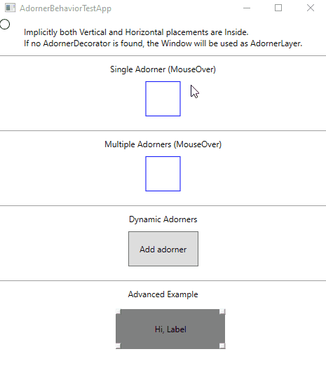

# AdornerBehavior
Adorner Behavior by wuijong and Ashley Davis.
This is a fixed version viable for use in modern world.

## Changes
* Built against .NET Framework 4.6.1 and .NET Core 3.1.
* Fixed bugs and memory leaks.
* Removed single child only variant.
* Adorner collection does not need an encapsulating array.
* The codebase was refactored and cleaned.
* New test app.
* The naming of functions was changed to better reflect the usage.
* Position of adorners are implicitly set to be inside the adorning control.
* Adorner collection implements INotifyCollectionChanged, which allows manipulation at runtime.

## Usage
Check out the TestApp Project or the original [article](https://www.codeproject.com/Articles/123638/A-Resusable-Attached-Behavior-for-Defining-Adorner).

## Quick Example
First, define the AdornerBehavior.Adorners collection for the adorning control.
Then, you can either set the AdornerBehavior.IsEnabled property to True on the adorning control to show the adorners,
or you can bind it's value to some code behind and define a more complex behavior. Both approaches are shown in the Test App.
```xaml
<Window xmlns:ab="clr-namespace:AdornerBehavior;assembly=AdornerBehavior">
    ...
    <AdornerDecorator>
        <Rectangle Width="50"
                   Height="50"
                   ab:AdornerBehavior.IsEnabled="True">
            <ab:AdornerBehavior.Adorners>
                <Ellipse Width="15"
                         Height="15"
                         HorizontalAlignment="Left"
                         ab:AdornerBehavior.HorizontalPlacement="Across"
                         Stroke="Green" />
                ...
            </ab:AdornerBehavior.Adorners>
        </Rectangle>
    </AdornerDecorator>
    ...
</Window>
```

## Showcase
<p align="center">
  
</p>

## Disclaimer
The code **was not tested** thorougly, and probably **is not** suitable for use in production.

I am open to suggestions and PRs.

## Licenses
Original work was licensed under CPOL and so is this.
